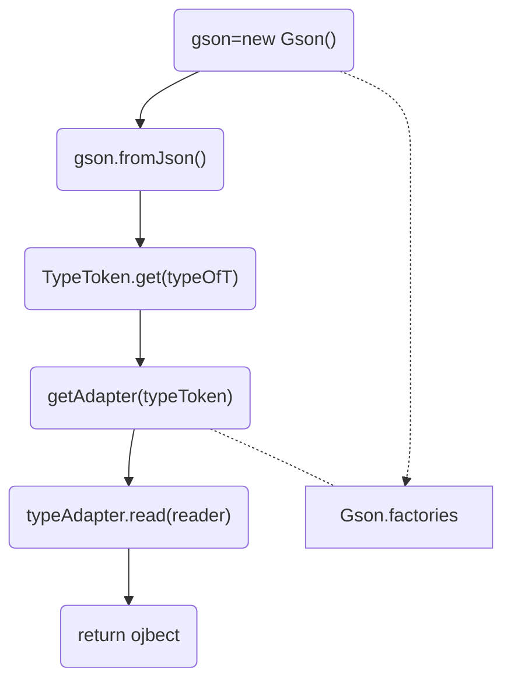
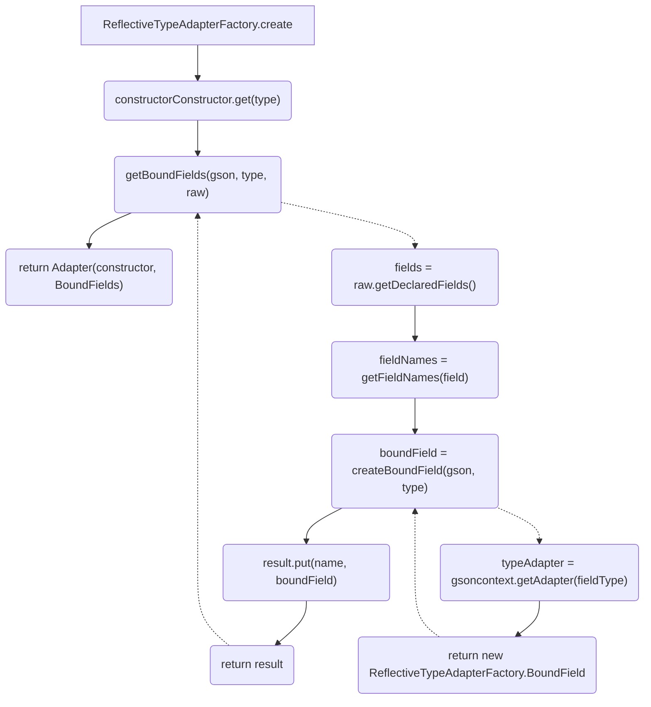

# 使用

```java
@Data
public class User {
    private String name;
    private int age;
    private List<String> tags;
}

public class Main {
    public static void main(String[] args) {
        Gson gson =new Gson();
        User user= new User();
        user.setName("anemone");
        user.setAge(18);
        user.setTags(Arrays.asList(new String[] { "123", "456", "789" }));
        String json=gson.toJson(user); // 序列化
        System.out.println(json);

        User u=gson.fromJson(json,User.class); // 反序列化
        System.out.println(u);
    }
}
```

# 反序列化过程

```java
com.google.gson.Gson#fromJson(String, java.lang.Class<T>)
    Gson#fromJson(String, java.lang.reflect.Type)
    	Gson#fromJson(Reader, Type)
        	Gson#fromJson(com.google.gson.stream.JsonReader, Type)
```

## Gson#fromJson

该方法算是真正的入口方法，JsonReader是一个迭代器，可以获取整个json字符串，Type指定反序列化的对象。大致分为三步：1，获取TypeToken2，获取TypeAdapter，其作为序列化反序列化适配器，实现read/write，用于json序列化和反序列化方法3，使用该对象的反序列化适配器读取对象

```java
  public <T> T fromJson(JsonReader reader, Type typeOfT) throws JsonIOException, JsonSyntaxException {
    boolean isEmpty = true;
    boolean oldLenient = reader.isLenient();
    reader.setLenient(true);
    try {
      reader.peek(); // 将指针移动到下一个token起始，并且检查token类型
      isEmpty = false;
      // Step1: 获取 TypeToken
      TypeToken<T> typeToken = (TypeToken<T>) TypeToken.get(typeOfT); 
      // Step2: 获取TypeAdapter
      TypeAdapter<T> typeAdapter = getAdapter(typeToken);
      // Step3: 使用adapter读取对象
      T object = typeAdapter.read(reader); 
      return object;
    } catch (EOFException e) {
      /*...*/
    } finally {
      reader.setLenient(oldLenient);
    }
  }
```

## TypeToken#get(java.lang.reflect.Type)

该函数实际调用了TypeToken的构造函数

```java
  TypeToken(Type type) {
    this.type = $Gson$Types.canonicalize($Gson$Preconditions.checkNotNull(type));
    this.rawType = (Class<? super T>) $Gson$Types.getRawType(this.type);
    this.hashCode = this.type.hashCode();
  }
```

## com.google.gson.Gson#getAdapter(TypeToken<T>)

该函数通过TypeToken获取一个Adapter：

```java
  public <T> TypeAdapter<T> getAdapter(TypeToken<T> type) {
    TypeAdapter<?> cached = typeTokenCache.get(type == null ? NULL_KEY_SURROGATE : type);
    // 如果有缓存则直接取出
    if (cached != null) {return (TypeAdapter<T>) cached;}

    Map<TypeToken<?>, FutureTypeAdapter<?>> threadCalls = calls.get();
    /* 和线程有关配置...*/

    // 猜测还是一个缓存
    FutureTypeAdapter<T> ongoingCall = (FutureTypeAdapter<T>) threadCalls.get(type);
    if (ongoingCall != null) {
      return ongoingCall;
    }

    try {
      FutureTypeAdapter<T> call = new FutureTypeAdapter<T>();
      threadCalls.put(type, call);
      // 遍历所有的 TypeAdapterFactory ，找到匹配的 Adapter
      for (TypeAdapterFactory factory : factories) {
        TypeAdapter<T> candidate = factory.create(this, type);
        if (candidate != null) {
          call.setDelegate(candidate);
          typeTokenCache.put(type, candidate);
          return candidate;
        }
      }
      throw new IllegalArgumentException("GSON (" + GsonBuildConfig.VERSION + ") cannot handle " + type);
    } finally {/*...*/  }
  }
```

在for循环中调用了Factory#create()，在工厂中如果type匹配则生产一个Adapter，否则返回null，具体实现就要看各自factory的实现了。

## com.google.gson.Gson#factories

factory在com.google.gson.Gson#Gson(Excluder, FieldNamingStrategy, Map, boolean, boolean, boolean, boolean, boolean, boolean, boolean, LongSerializationPolicy, String, int, int, List, List, List)初始化时设置，以下为Gson支持的所有序列化类型：

```java
    List<TypeAdapterFactory> factories = new ArrayList<TypeAdapterFactory>();

    // built-in type adapters that cannot be overridden
    factories.add(TypeAdapters.JSON_ELEMENT_FACTORY);
    factories.add(ObjectTypeAdapter.FACTORY);

    // the excluder must precede all adapters that handle user-defined types
    factories.add(excluder);

    // 用户自定义
    factories.addAll(factoriesToBeAdded);

    // type adapters for basic platform types
    factories.add(TypeAdapters.STRING_FACTORY);
    factories.add(TypeAdapters.INTEGER_FACTORY);
    factories.add(TypeAdapters.BOOLEAN_FACTORY);
    factories.add(TypeAdapters.BYTE_FACTORY);
    factories.add(TypeAdapters.SHORT_FACTORY);
    TypeAdapter<Number> longAdapter = longAdapter(longSerializationPolicy);
    factories.add(TypeAdapters.newFactory(long.class, Long.class, longAdapter));
    factories.add(TypeAdapters.newFactory(double.class, Double.class,
            doubleAdapter(serializeSpecialFloatingPointValues)));
    factories.add(TypeAdapters.newFactory(float.class, Float.class,
            floatAdapter(serializeSpecialFloatingPointValues)));
    factories.add(TypeAdapters.NUMBER_FACTORY);
    factories.add(TypeAdapters.ATOMIC_INTEGER_FACTORY);
    factories.add(TypeAdapters.ATOMIC_BOOLEAN_FACTORY);
    factories.add(TypeAdapters.newFactory(AtomicLong.class, atomicLongAdapter(longAdapter)));
    factories.add(TypeAdapters.newFactory(AtomicLongArray.class, atomicLongArrayAdapter(longAdapter)));
    factories.add(TypeAdapters.ATOMIC_INTEGER_ARRAY_FACTORY);
    factories.add(TypeAdapters.CHARACTER_FACTORY);
    factories.add(TypeAdapters.STRING_BUILDER_FACTORY);
    factories.add(TypeAdapters.STRING_BUFFER_FACTORY);
    factories.add(TypeAdapters.newFactory(BigDecimal.class, TypeAdapters.BIG_DECIMAL));
    factories.add(TypeAdapters.newFactory(BigInteger.class, TypeAdapters.BIG_INTEGER));
    factories.add(TypeAdapters.URL_FACTORY);
    factories.add(TypeAdapters.URI_FACTORY);
    factories.add(TypeAdapters.UUID_FACTORY);
    factories.add(TypeAdapters.CURRENCY_FACTORY);
    factories.add(TypeAdapters.LOCALE_FACTORY);
    factories.add(TypeAdapters.INET_ADDRESS_FACTORY);
    factories.add(TypeAdapters.BIT_SET_FACTORY);
    factories.add(DateTypeAdapter.FACTORY);
    factories.add(TypeAdapters.CALENDAR_FACTORY);
    factories.add(TimeTypeAdapter.FACTORY);
    factories.add(SqlDateTypeAdapter.FACTORY);
    factories.add(TypeAdapters.TIMESTAMP_FACTORY);
    factories.add(ArrayTypeAdapter.FACTORY);
    factories.add(TypeAdapters.CLASS_FACTORY);

    // type adapters for composite and user-defined types
	// 以下是一些组合类型和用户类的adapter
    factories.add(new CollectionTypeAdapterFactory(constructorConstructor));
    factories.add(new MapTypeAdapterFactory(constructorConstructor, complexMapKeySerialization));
    this.jsonAdapterFactory = new JsonAdapterAnnotationTypeAdapterFactory(constructorConstructor);
	// 与Annotation有关的adaptor
    factories.add(jsonAdapterFactory);
    factories.add(TypeAdapters.ENUM_FACTORY);
    // 这条就是用户类的adapter了
    factories.add(new ReflectiveTypeAdapterFactory(
        constructorConstructor, fieldNamingStrategy, excluder, jsonAdapterFactory));
```

## 流程图



# com.google.gson.internal.bind.ReflectiveTypeAdapterFactory

如果传入的classType不在之前的factory中，且继承Object对象，那么就会被此Factory处理，返回一个Adapter，其包括了能构造对象实例的constructor，和该类中的所有Fields的（反）序列化方法：

```java
public final class ReflectiveTypeAdapterFactory implements TypeAdapterFactory {
  private final ConstructorConstructor constructorConstructor;
  private final FieldNamingStrategy fieldNamingPolicy;
  private final Excluder excluder;
  private final JsonAdapterAnnotationTypeAdapterFactory jsonAdapterFactory;
  private final ReflectionAccessor accessor = ReflectionAccessor.getInstance();
  @Override public <T> TypeAdapter<T> create(Gson gson, final TypeToken<T> type) {
    Class<? super T> raw = type.getRawType();
	//type是否是Object类型的子类
    if (!Object.class.isAssignableFrom(raw)) {
      return null; // it's a primitive!
    }

    ObjectConstructor<T> constructor = constructorConstructor.get(type);
    return new Adapter<T>(constructor, getBoundFields(gson, type, raw));
  }
  /* ... */
}
```

## getBoundFields()

返回Adapter时，会传一个`getBoundFields(gson, type, raw)`，它返回类中的所有可序列化的Fields，具体来说，其通过反射，获取类的所有FieldNames，Type，再用createBoundField封装他们的（反）序列化方法。

```java
  private Map<String, BoundField> getBoundFields(Gson context, TypeToken<?> type, Class<?> raw) {
    Map<String, BoundField> result = new LinkedHashMap<String, BoundField>();
    if (raw.isInterface()) {return result;}
    Type declaredType = type.getType();
    while (raw != Object.class) {
      // 通过反射，调用所有类
      Field[] fields = raw.getDeclaredFields();
      for (Field field : fields) {
        boolean serialize = excludeField(field, true);
        boolean deserialize = excludeField(field, false);
        if (!serialize && !deserialize) {continue;}
        accessor.makeAccessible(field);
        Type fieldType = $Gson$Types.resolve(type.getType(), raw, field.getGenericType());
        List<String> fieldNames = getFieldNames(field); //没搞懂为什么一个Field有多个fieldNames
        BoundField previous = null;
        // 对于每一个fieldName，用createBoundField
        for (int i = 0, size = fieldNames.size(); i < size; ++i) {
          String name = fieldNames.get(i);
          if (i != 0) serialize = false; // only serialize the default name
          BoundField boundField = createBoundField(context, field, name,
              TypeToken.get(fieldType), serialize, deserialize);
          BoundField replaced = result.put(name, boundField);
          if (previous == null) previous = replaced;
        }
        if (previous != null) {/*...*/}
      }
      type = TypeToken.get($Gson$Types.resolve(type.getType(), raw, raw.getGenericSuperclass()));
      raw = type.getRawType();
    }
    return result;
  }
```

## createBoundField()

createBoundField()函数返回BoundField对象，其中包含了Field的read,write等方法，其调用之前factory产生的adapter，获取返回值之后，通过反射将将值写入属性：

```java
  private ReflectiveTypeAdapterFactory.BoundField createBoundField(
      final Gson context, final Field field, final String name,
      final TypeToken<?> fieldType, boolean serialize, boolean deserialize) {
    final boolean isPrimitive = Primitives.isPrimitive(fieldType.getRawType());
    // special casing primitives here saves ~5% on Android...
    JsonAdapter annotation = field.getAnnotation(JsonAdapter.class);
    TypeAdapter<?> mapped = null;
    
    if (annotation != null) {
      mapped = jsonAdapterFactory.getTypeAdapter(
          constructorConstructor, context, fieldType, annotation);
    }
    final boolean jsonAdapterPresent = mapped != null;
    // 再次调用Gson#getAdapter(),找到能(反)序列化当前Field的Adaptor
    if (mapped == null) mapped = context.getAdapter(fieldType);

    final TypeAdapter<?> typeAdapter = mapped;
    // 返回BoundField类，其read/write方法调用了Adaptor的read/write方法
    return new ReflectiveTypeAdapterFactory.BoundField(name, serialize, deserialize) {
      // the type adapter and field type always agree
      @Override void write(JsonWriter writer, Object value)
          throws IOException, IllegalAccessException {
        Object fieldValue = field.get(value);
        TypeAdapter t = jsonAdapterPresent ? typeAdapter
            : new TypeAdapterRuntimeTypeWrapper(context, typeAdapter, fieldType.getType());
        t.write(writer, fieldValue);
      }
      @Override void read(JsonReader reader, Object value)
          throws IOException, IllegalAccessException {
        Object fieldValue = typeAdapter.read(reader);
        if (fieldValue != null || !isPrimitive) {
          //反射设置值
          field.set(value, fieldValue);
        }
      }
      @Override public boolean writeField(Object value) throws IOException, IllegalAccessException {
        if (!serialized) return false;
        Object fieldValue = field.get(value);
        return fieldValue != value; // avoid recursion for example for Throwable.cause
      }
    };
  }
```

## create流程图



##  read()

在自定义类反序列化时，会调用com.google.gson.internal.bind.ReflectiveTypeAdapterFactory.Adapter#read()方法：

```java
  public static final class Adapter<T> extends TypeAdapter<T> {
    private final ObjectConstructor<T> constructor;
    private final Map<String, BoundField> boundFields;
    @Override public T read(JsonReader in) throws IOException {
      if (in.peek() == JsonToken.NULL) {
        in.nextNull();
        return null;
      }
      T instance = constructor.construct();
      try {
        in.beginObject();
        // 递归调用field的Adapter.read()
        while (in.hasNext()) {
          String name = in.nextName();
          BoundField field = boundFields.get(name);
          if (field == null || !field.deserialized) {
            in.skipValue();
          } else {
            field.read(in, instance); 
          }
        }
      } catch (IllegalStateException e) {/*...*/} catch (IllegalAccessException e) {/*...*/}
      in.endObject();
      return instance;
    }
  }
```

# String

再看一下String的反序列化操作吧，com.google.gson.internal.bind.TypeAdapters#STRING_FACTORY：

```java
public static final TypeAdapterFactory STRING_FACTORY = newFactory(String.class, STRING);
```

`newFactory()`把一个Adapter封装成一个类，STRING是一个adapter：

```java
  public static final TypeAdapter<String> STRING = new TypeAdapter<String>() {
    @Override
    public String read(JsonReader in) throws IOException {
      JsonToken peek = in.peek();
      if (peek == JsonToken.NULL) {
        in.nextNull();
        return null;
      }
      /* coerce booleans to strings for backwards compatibility */
      if (peek == JsonToken.BOOLEAN) {
        return Boolean.toString(in.nextBoolean());
      }
      // 读取一个字符串
      return in.nextString();
    }
    @Override
    public void write(JsonWriter out, String value) throws IOException {
      out.value(value);
    }
  };
```

# Map

再看一下Map的read()，先

```java
    @Override public Map<K, V> read(JsonReader in) throws IOException {
      JsonToken peek = in.peek();
      if (peek == JsonToken.NULL) {
        in.nextNull();
        return null;
      }

      Map<K, V> map = constructor.construct();

      if (peek == JsonToken.BEGIN_ARRAY) {
        in.beginArray();
        while (in.hasNext()) {
          in.beginArray(); // entry array
          K key = keyTypeAdapter.read(in);
          V value = valueTypeAdapter.read(in);
          V replaced = map.put(key, value);
          if (replaced != null) {
            throw new JsonSyntaxException("duplicate key: " + key);
          }
          in.endArray();
        }
        in.endArray();
      } else {
        in.beginObject();
        while (in.hasNext()) {
          JsonReaderInternalAccess.INSTANCE.promoteNameToValue(in);
          K key = keyTypeAdapter.read(in);
          V value = valueTypeAdapter.read(in);
          V replaced = map.put(key, value);
          if (replaced != null) {
            throw new JsonSyntaxException("duplicate key: " + key);
          }
        }
        in.endObject();
      }
      return map;
    }
```

